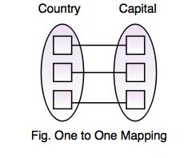
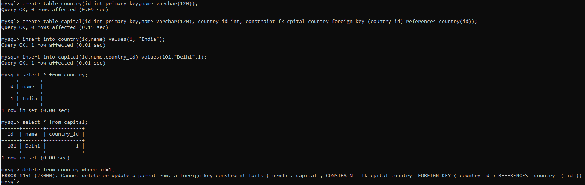
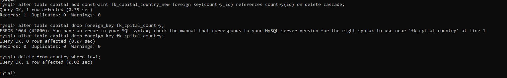

# one to one relationships (1 to 1)
This relationship exists when every row in table A can only be linked with another one row in table B.

# creating the country table
CREATE TABLE Country(
country_id INT PRIMARY KEY,
name VARCHAR(100)
);

# creating the capital table
CREATE TABLE Capital(
capital_id INT PRIMARY KEY,
name VARCHAR(100),
c_id INT,
CONSTRAINT fk_country_capital FOREIGN KEY (c_id) REFERENCES Country(country_id)
);

# inserting records
INSERT INTO Country (country_id, name) VALUES (52,'China');
INSERT INTO Country (country_id, name) VALUES (99, 'United Kingdom');

INSERT INTO Capital (capital_id, name, c_id) VALUES (15,'Beijing',52);
INSERT INTO Capital (capital_id, name, c_id) VALUES (23,'London',99);

# Let’s see how to delete rows from Country table.
DELETE FROM Country WHERE country_id=52;

it will throw an error: “Cannot delete or update a parent row: a foreign key constraint fails”. This error is due to MySQL foreign key check.

# The best way to solve this to add ON DELETE CASCADE constraint.
ALTER TABLE Capital
ADD CONSTRAINT fk_country_capital_new
FOREIGN KEY (c_id) REFERENCES Country(country_id)
ON DELETE CASCADE;

ALTER TABLE Capital DROP FOREIGN KEY fk_country_capital;

# delete failed on one to one mapping

